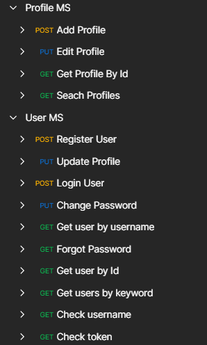

# FacebookServer

## Steps to start the sever:
### 1. Run the table script on mysql server
### 2. Change the username and password in application.yml of all the microservices
### 3. Start the consul server "consul agent -server -bootstrap-expect=1 -data-dir=consul-data -ui -bind=127.0.0.1"
### 4. Import and install all the dependencies in microservices
### 5. Start all the microservices
### 6. For sonarqube report - clean install sonar:sonar -X
#### Check report at - http://vjeemys-48:9000/dashboard?id=Infy_Group39

| Screenshots |
|---|
|  |
|  |
|  |